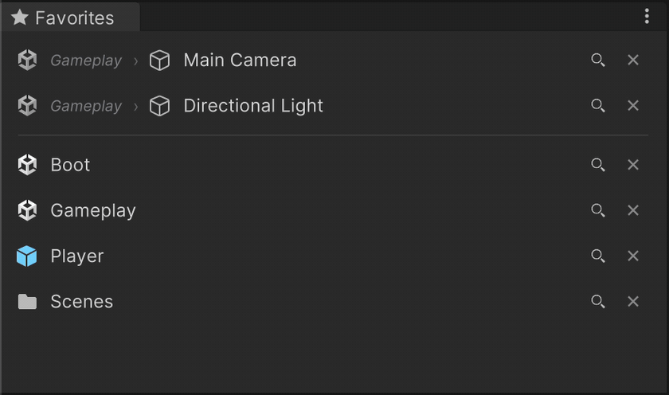
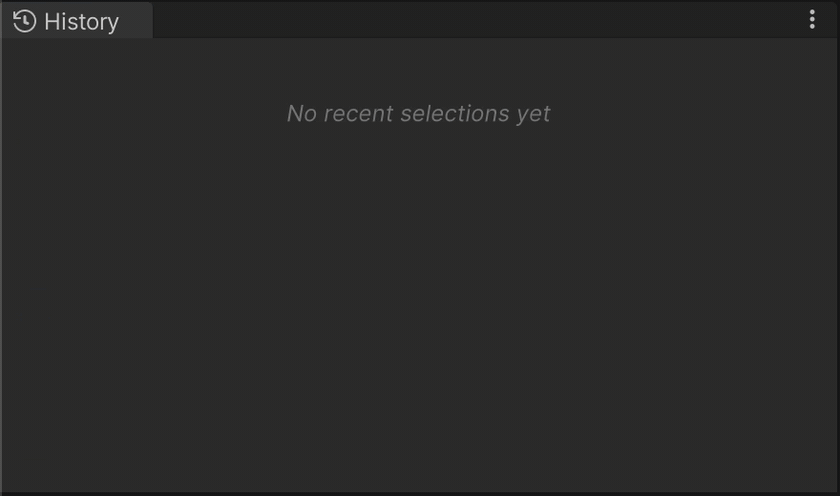
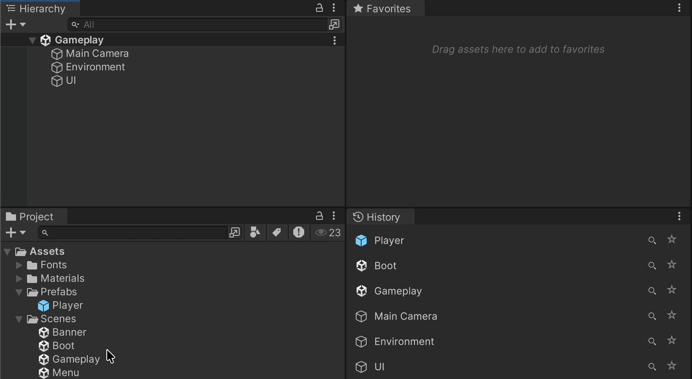
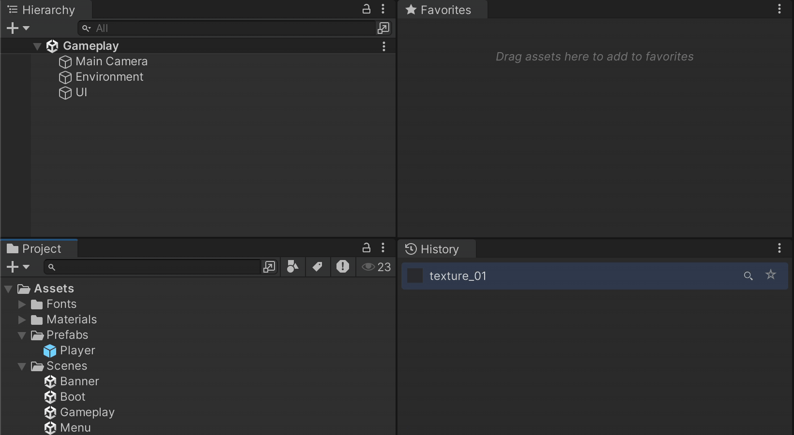
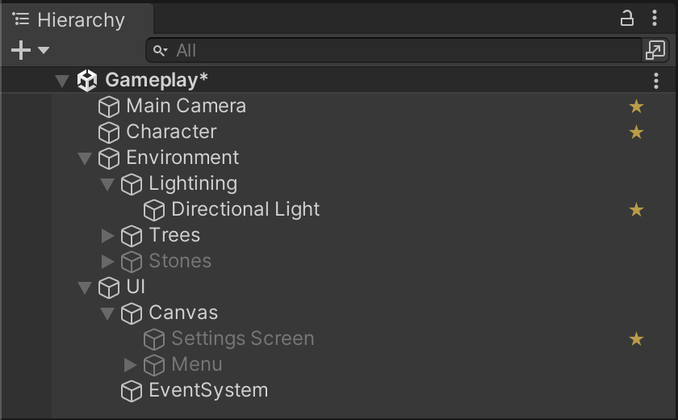
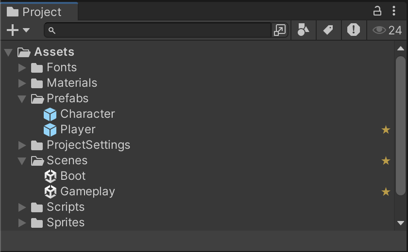
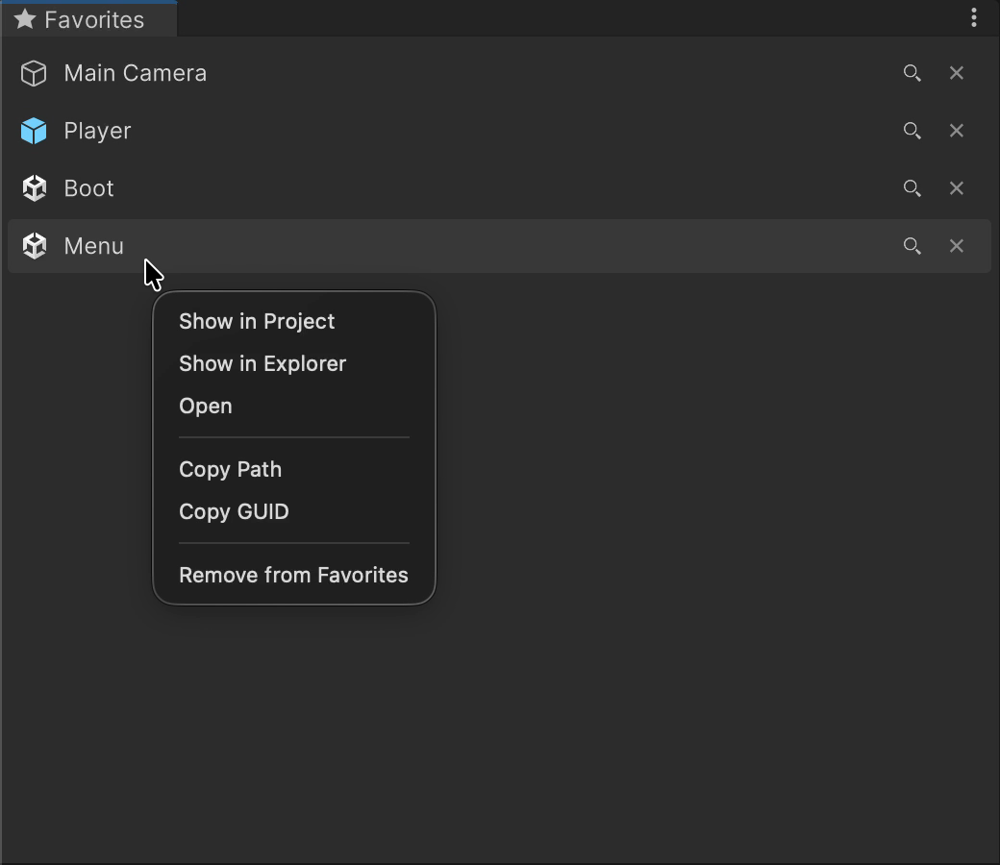
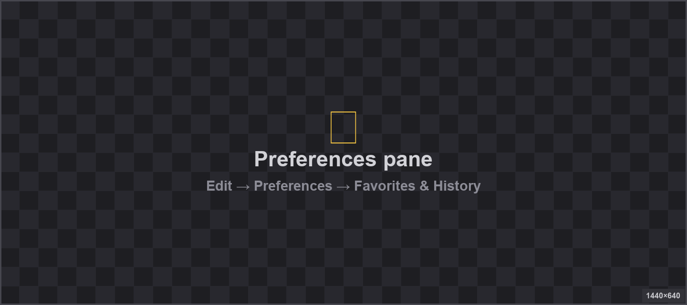

<div align="center">


# Starred

**Favorites tray + selection history for the Unity Editor.**

[](https://unity.com/releases/editor/qa/lts-releases)
[](LICENSE.md)
[](https://github.com/landosilva/starred/releases)
[](https://github.com/landosilva)

 

</div>

---

## Install

**Package Manager (recommended):**
**Window → Package Manager → + → Add package from git URL…**

```
https://github.com/landosilva/starred.git
```

Pin to a release:

```
https://github.com/landosilva/starred.git#v0.1.6
```

Or clone and use **Add package from disk…** → `package.json`.

Requires **Unity 2022.3 LTS** or newer.

## Favorites

`Tools → Starred → Favorites`

<div align="center">

</div>

- Drop in project assets or scene GameObjects.
- Click to select. Double-click to open or frame.
- Drag out onto Inspector fields.
- Reorder by drag. Lens icon to ping in Project/Hierarchy.

Scene-bound entries use `scene-path + hierarchy-path`, so they only appear while their scene is loaded. Missing or renamed objects show red.

## Selection History

`Tools → Starred → History`

<div align="center">

</div>

Auto-populated, most-recent-first. Re-selecting bumps to the top. Each row has a ★ button to promote to Favorites. Size caps at 4 / 8 / 16 / 32.

## Star Overlays

Favorited items get a ★ overlay in the **Project** and **Hierarchy** windows. Click the overlay to unfavorite directly.

<div align="center">
 
</div>

Both overlays toggle independently in Preferences.

## Context Menu

Every row has a context menu:

- 👁 Show in Project / Hierarchy
- 🗂 Show in Explorer
- ↗️ Open — opens the asset in its default editor (scene, IDE, prefab stage…)
- 📷 Frame in Scene View
- 📋 Copy Path / GUID / Hierarchy Path
- ❌ Remove from Favorites

<div align="center">

</div>

## Preferences

- **macOS:** Unity → Settings → Starred
- **Windows:** Edit → Preferences → Starred

<div align="center">

</div>

- **Show star in Project window** — toggle Project ★ overlay.
- **Show star in Hierarchy** — toggle Hierarchy ★ overlay.
- **Selection history max entries** — 4 / 8 / 16 / 32.

Also available on each window's ⋮ menu.

## Data

| What | Where | Scope |
| --- | --- | --- |
| Favorites | `UserSettings/FavoriteAssets.json` | Per-user, per-project. GUID-based. |
| History | `UserSettings/SelectionHistory.json` | Per-user, per-project. |
| Preferences | `EditorPrefs` | Per-user, per-machine. |

Nothing touches `Assets/`.

## Compatibility

| Unity | Status |
| --- | --- |
| 6000.0 LTS | ✅ Tested |
| 2022.3 LTS | ✅ Tested |
| Older | ❌ Not supported |

Editor-only. No runtime footprint, no dependencies.

## License

[MIT License](LICENSE.md)
