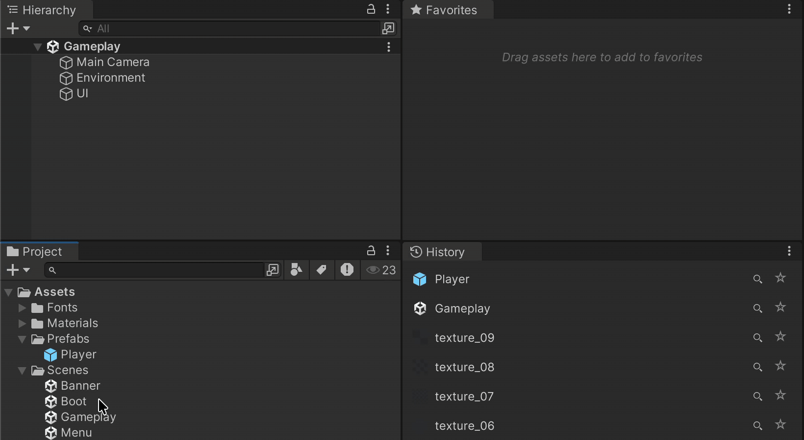
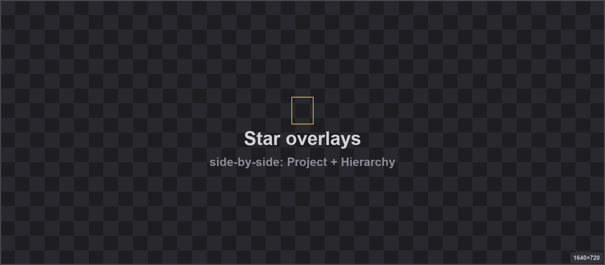

<div align="center">

<!-- SLOT: banner -->


# Starred

**A compact favorites tray plus selection history for the Unity Editor.**

[](https://unity.com/releases/editor/qa/lts-releases)
[](LICENSE.md)
[](https://github.com/landosilva/starred/releases)
[](https://github.com/landosilva)

<!-- SLOT: hero -->


</div>

---

## Why Starred

You already know the loop: hunt the Project window for that one prefab, lose it again ten minutes later, `Ctrl+Shift+F` your way back. Starred is a two-window fix — pin what you reach for, and scroll back through what you just had selected. No folders, no workspaces, no second Project window — just a flat tray and a short memory.

## Design philosophy

Starred is intentionally small. Folders, workspaces, tabs, nested groups and embedded inspectors have all been considered and deliberately left out — the point is a compact, actionable tray, not a second Project window. If you need hierarchy, you already have one.

## Contents

- [Install](#install)
- [Favorites](#favorites)
- [Selection History](#selection-history)
- [Star overlays](#star-overlays)
- [Right-click, anywhere](#right-click-anywhere)
- [Preferences](#preferences)
- [Where your data lives](#where-your-data-lives)
- [Compatibility](#compatibility)
- [License](#license)

## Install

**Package Manager — git URL (recommended):**

In Unity: **Window → Package Manager → + → Add package from git URL…**

```
https://github.com/landosilva/starred.git
```

**Pin to a release:**

```
https://github.com/landosilva/starred.git#v0.1.2
```

**Local clone:**

Clone the repo and pick **Add package from disk…**, pointing at the package's `package.json`.

Requires Unity **2022.3 LTS** or newer.

## Favorites

`Tools → Starred → Favorites`

A flat, ordered tray of the things you keep reaching for.

<div align="center">

<!-- SLOT: favorites -->


</div>

- **Drop in** project assets *or* Hierarchy / Prefab-Stage GameObjects.
- **Single-click** to select (Inspector follows).
- **Double-click** to open the asset — or frame the GameObject in Scene View.
- **Lens** to ping in Project / Hierarchy.
- **Drag out** onto an Inspector object field.
- **Reorder** by drag.

Scene-bound entries are stored with a `scene-path + hierarchy-path` reference, so they only show up while their owning scene or prefab stage is the active context. Favorites from other scenes stay out of the way. If the scene is open but the object has been renamed or deleted, the row goes red so you know.

## Selection History

`Tools → Starred → History`

An auto-populated list of the last things you selected — both assets and scene GameObjects. Most-recent-first. Re-selecting bumps to the top.

<div align="center">

<!-- SLOT: history -->


</div>

Each row has a ★ button that promotes an entry straight into Favorites. Size caps at 4 / 8 / 16 / 32 via Preferences or the window's 3-dot menu.

## Star overlays

Favorited items get a small gold ★ drawn on top of their row — in the **Project** window (list *and* grid views) and in the **Hierarchy** / Prefab Stage. Click the star to unfavorite without opening Starred at all.

<div align="center">

<!-- SLOT: overlays -->


</div>

Both overlays toggle independently in Preferences.

## Right-click, anywhere

Every row in both windows has a full context menu:

- Show in Project / Explorer / Hierarchy
- Open / Frame in Scene View
- Copy Path / GUID / Hierarchy Path
- Remove from Favorites

<div align="center">

<!-- SLOT: context-menu -->


</div>

## Preferences

**Unity → Settings → Starred** (macOS, Unity 6) — or **Edit → Preferences → Starred** (Windows, Unity 2022).

<div align="center">

<!-- SLOT: preferences -->


</div>

- **Show star in Project window** — toggle the Project ★ overlay.
- **Show star in Hierarchy** — toggle the Hierarchy ★ overlay.
- **Selection history max entries** — 4 / 8 / 16 / 32. Shrinking trims existing history immediately.

The same toggles, plus **Clear** and **Open Preferences**, are available on each window's 3-dot menu.

## Where your data lives

| What | Where | Scope |
| --- | --- | --- |
| Favorites | `UserSettings/FavoriteAssets.json` | Per-user, per-project. GUID-based — survives rename / move. |
| Selection history | `UserSettings/SelectionHistory.json` | Per-user, per-project. |
| Preferences toggles | `EditorPrefs` | Per-user, per-machine. |

Nothing lives inside `Assets/`, so nothing ends up in version control by accident.

## Compatibility

| Unity | Status |
| --- | --- |
| 6000.0 LTS | ✅ Tested |
| 2022.3 LTS | ✅ Tested |
| Older | ❌ Not supported |

Editor-only. No runtime footprint, no scripting define symbols, no dependencies beyond the Unity Editor.

## License

Released under the [MIT License](LICENSE.md) — free to use, modify and distribute, including commercially.
